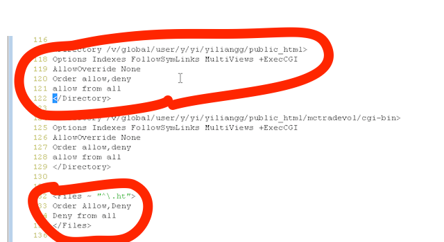

#Morgan Stanley ME Tool Document

```
@auth: Yiliang,Guo(yiliangg@foxmail.com)
@date: 2014-09-11
@update: 2014-09-11
@collaborators: Yikun,Xian(siriusxyk@gmail.com)

```


##1. What is ME tool?

ME(Month End) tool is a tool which is used to predict transaction and memo MIPS volume. With this tool, user is given the power to know the MIPS volume of ME-1,ME and ME+1 before ME-1 date. 

Some mathematics model support ME tool to predict MIPS volume of feature. We implemented it by python. Besides, this tool supply a user-friendly web page so that user can view prediction data or history data by table and charts. 


##2. Architecture Overview

###2.1 Key Technology

You should know technologies listed below if you want to add some features or change functions of this tool.

**Language:** Python2.7x, Javascript

**Framework:** Flask, Bootstrap3.x , HighChart, AngularJs

**Server:** Apache or Nginx

**DataBase:** Sqlite


###2.2 System Architecture
ME tool is a python-base project. We implement core functions like Mathematics model and Rest API by python. With these, we can load data and show up in our web page which is managed by AngularJS FrameWord. 

AngularJS is a MVC framework for web development. In this project, we manage data which load from rest api (by python backend) by angularJS and render data to our web page.

Besides, we use SQLite to persistent data. It is very easy and convenient to use in Morgan Stanley's Linux Environment.


###2.3 Code Organisation

```
- static   
	- css //style sheet
	- image
	- js //js
		- app.js //main js of angular
		- controller.js //controller of angular
		- services.js //service which loads data by angular
	- partials //page html
		- partial1.html //prediction page
		- partial2.html //History trend page
		- partial3.html //APE track page
- templates //
- uploads   //file upload folder
app.py  //The entrance of flask
modeling.py //Modeling program written by @YiKun
config.cfg //Configuration file of flask

```


###2.4 Configuration

####2.4.1 Config server
ME tool should be accessed by cgi program which written by perl language so that we need to proxy server to make it as a public service. At first, we should get a **Apache**[http://www.apache.org/](http://www.apache.org/) Server in Morgan Stanley environment by DWS.

After you finish installation of your own DWS, you can set up it by change its configs file:

location: /var/tmp/dws.{dwsname}/instances/{instance_name}/apache/conf/httpsd.conf

1. Point document root to your home directory
	
	
2. Config cgi-bin run environment.
	
	
	
####2.4.2 Config Path

```
SQLALCHEMY_DATABASE_URI = (Path to your ms.db)

UPLOAD_FOLDER = (Path to file upload directory) //Must given write authority
```


###2.5 Running 
At first ,place your flask program in cgi-bin directory which under your DWS apache directory.  Then write a peace of code to cal WSGI proxy.
I write a cgi_handler.cgi


You can test your program can run or not by :

```
  python app.py 
```

If no error, you can access your service by your DWS server:


```
	http://fdsfsadfdsa...cgi_handler.cgi

```


###2.6 DataBase Management

Just access sqlite database ms.db in code root directory.

```
  sqlite3 ms.db
 
 >>.tables
 ...
 ...
 >>select * from xxxxx;
 ...
 ...
```


###2.7 AiAi's Formula

Please check email I send to u,


```
那么输出就是7个模型新的参数（beta和P）

1) Recursive Algorithm
    former image is recursive formula.
where P0=I * 10^12 (I is Identity Matrix), λ=0.95, 0.97, 0.99


2) X_T Model

a) ME-1
     y = “predicted ME-1”
     x = (1, “5-day-average”, “week-to-date”)
         Notice: if ME-1 is Monday, “week-to-date” = “5-day-average”
     β = (49370077.5454166, 1.66201325669058, -0.794196017693839)

b) Mean ME
     y = “predicted mean ME”
          where "mean ME" = (ME-1 + ME + ME+1) / 3
     x = (1, “month-average”, “5-day-average”)
          where “month-average” = average from ME+2 to ME-2
     β = (50988154.8637934, 0.105872702335176, 0.665913079984654)

c) ME
     y = “predicted ME”     
     x = (1, “last-quarter ME”, “predicted mean ME”)
          For “last-quarter ME”: x1 of April = ME of January; x1 of May = ME of February …, so x1 of January is missing if there’s no data of last year
     β = (-13320854.3748666, 0.945726197256682, 0.219576458342143)

d) ME+1
     y = “predicted ME+1”     
     x = (1, “5-day-average”, “ME-4”, “initial-pred")
          For “initial-pred”, let’s define:
               ME+1(k) as the first workday of month k+1,
               m(k) as real value of ME+1(k-1),
               d(k) as diff-1 of month k, such that d(k) = m(k) - m(k-1),
               p(k) as pred-diff of month k, such that p(k) = d(k-2) + 0.3*(d(k-1) - d(k-2)) = 0.3*d(k-1) + 0.7*d(k-2)
          thus, “initial-pred of month k”, ip(k) = m(k-1) + p(k)
          so, ip of ME+1(k) equals to ip(k+1) = m(k) + 0.3*d(k) + 0.7*d(k-1)
     β = (83978545.2053504, -0.435110948279625, 0.838320389298151, 0.0636830837785078)

3) X_M Model

a) ME-1
     y = “predicted ME-1”
     x = (1, “X_M week-to-date”, “X_T week-to-date”, “X_T 5-day-average")
     β = (28297083.9073604, 1.00506197736856, 0.250755185036312, -0.415048232195793)

b) ME
     y = “predicted ME”
     x = (1, “5-day-average")
     β = (9947490.41767583, 0.697396219993049)

c) ME+1
     y = “predicted ME+1”
     x = (1, “5-day-average”, “ME-4”, “predicted ME")
     β = (38973762.3147386, -0.626437805324372, 0.284225953605474, 0.912630360528755)

```


