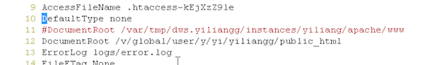

#Morgan Stanley TMIPS Project Hands On Document

##1. Architecture

This project is organised by tow parts: **View** and **Data Management**. 

###1.1 View 

View is implemented by EXTJS4 framework so that it is mainly controlled by Javascript. 

View request data from Data Management Part through its REST interface. 

###1.2 Data Management

**Data Management** Part have three features:

1. Calculate out prediction result by Recursive algorithm(can be change is you like)
2. Persistent Data to Sybase database
3. Supply REST interface

So the Architecture of this tool is as below:


* User only access the view layer
* Admin should load data to sybase database every month if the data need be updated.(We don't have a way to access the source data of MIPS automatically so that we only update data manually)


##2. DataBase Design

Please reference for [TMIPS Database Design Document]()


##3. Deployment

###3.1 Server
TMIPS should be accessed by cgi program which written by perl language so that we need to proxy server to make it as a public service. At first, we should get a **Apache**[http://www.apache.org/](http://www.apache.org/) Server in Morgan Stanley environment by DWS.

After you finish installation of your own DWS, you can set up it by change its configs file:

location: /var/tmp/dws.{dwsname}/instances/{instance_name}/apache/conf/httpsd.conf

1. Point document root to your home directory
	
	
2. Config cgi-bin run environment.
	
	
	
###3.2 Run
You can write a simple cgi script to test is the configuration work or not. If so, you can run TMIPS code in your own Home directory.

####3.2.1 Code Structure

The Tmips code directory is as below:

```
 - cgi-bin //restful interface supply
 	cip_algorithm.pl
 	global_mips.cgi
 	global_tradevol.cgi
 	history_tv_data.cgi
 	mape_calculator.cgi
 - docs
 	- css //style sheet
 	- images 
 	- js //javascript for different page. Each page's script will access restful interface by ajax
 	- lib
 	*.html //HTML page 
 - etc
 - loadData //load data and insert into database
	- bin
		loadTradeVolume.cgi
		loadData.pl
		loadDataTM.pl
	- etc
		*.csv //contains data load from remote database by **kit hoffman's** database auth.
```

####3.2.2 Data Setup and import to sybase database

1. Run script to load data from remote database.
	Tmips should get lastest **Trade Volume** data from remote database so that a script should be run to load it from remote database which auth is configured by **Kit Hoffman**. It is dangerous to use this configuration so that it is better to change a way to access **Trade Volume** Data source if it is possible.
	
```
Just access cgi loadTradeVolume.cgi in website.
	http://:myweb/~{username}/tmips/loadData/bin/loadTradeVolume.cgi

```


2. Train and inset to database

Before train, you should make sure the data in loadData/etc/* is correct. Besides, **mips.csv** should be prepare manually. Check latest data is in mips.csv file.
 
```
	./loadData.pl
```
